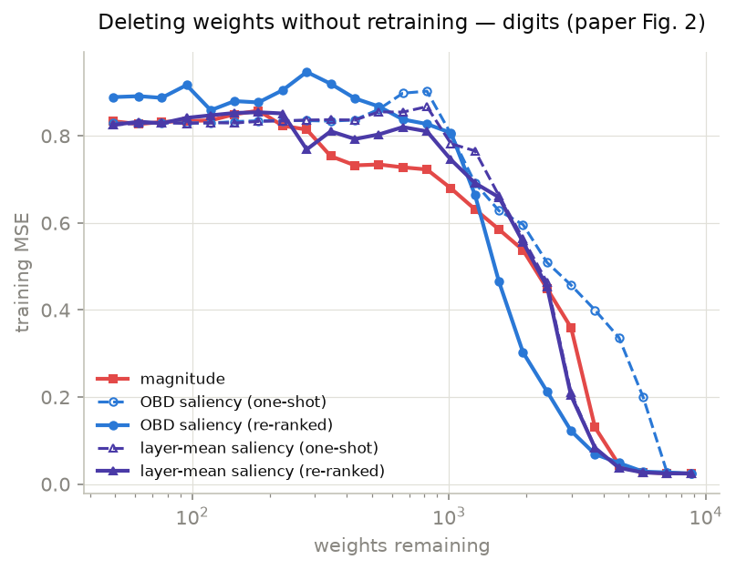
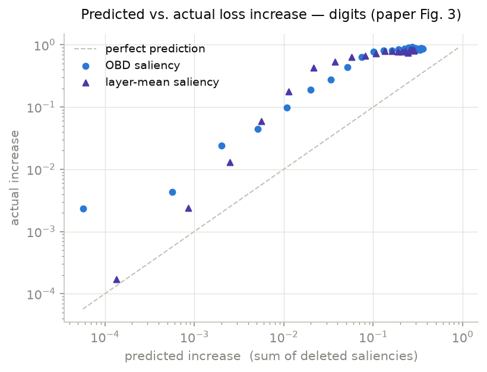
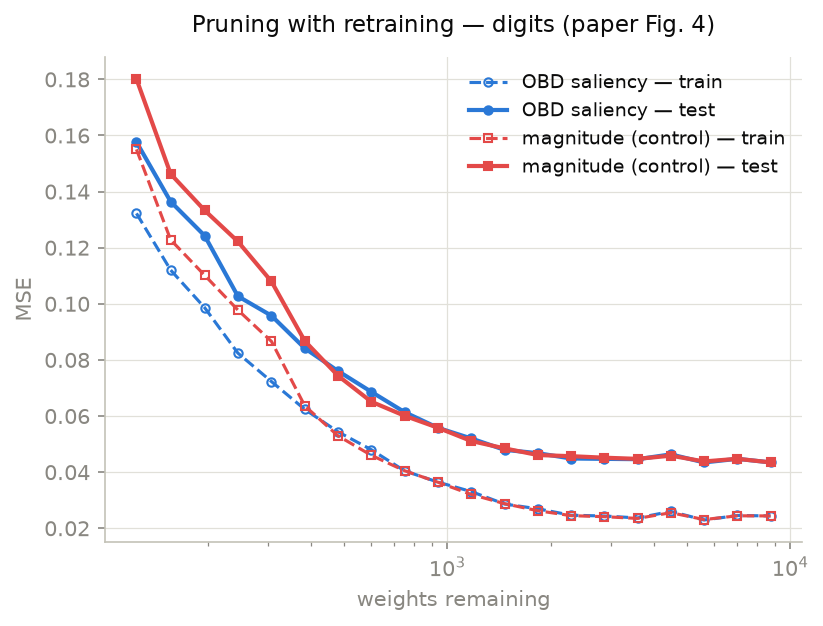
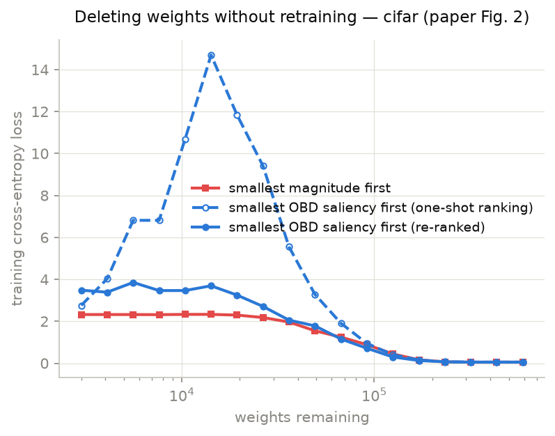
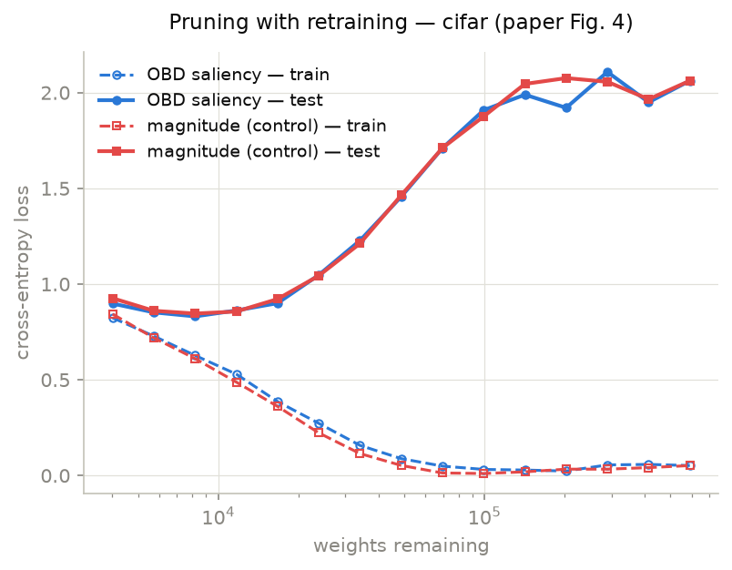
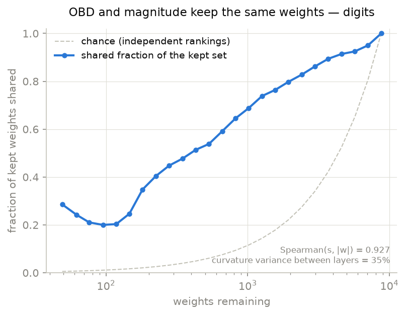
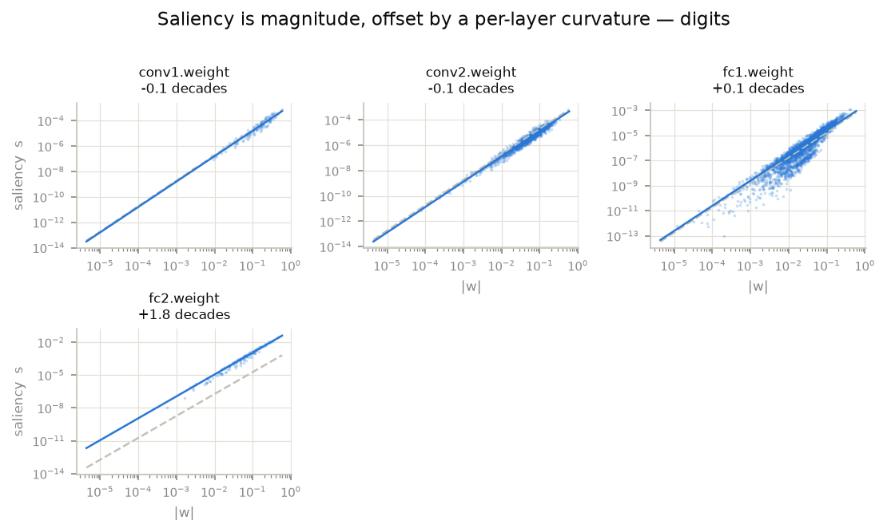
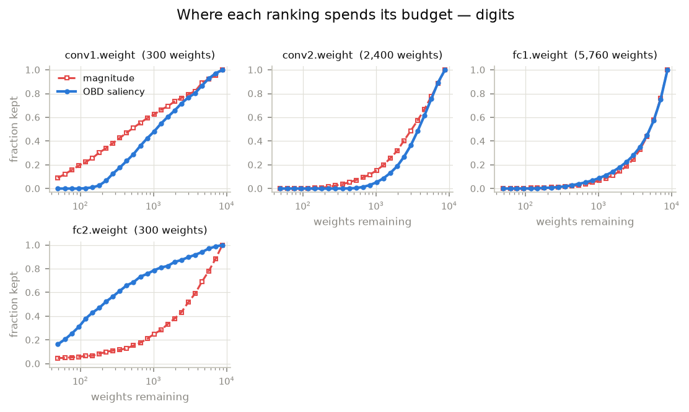

# Optimal Brain Damage — results

Reproduction of **LeCun, Denker & Solla, "Optimal Brain Damage" (NIPS 1989)**
plus a modern CIFAR-10 counterpart. The tables below are generated from
`results/*.json` by `python3 main.py --report` (don't edit inside the
`report:` markers). The **Reading** paragraphs are written by hand after each
full run. `obd.ipynb` has the full argument, with the code that produced each number.

## Scope: where this departs from the paper

- **Data.** The 1989 zip-code set isn't public, so MNIST is bilinearly
  downsampled to 16×16, rescaled to [−1, 1], and cut to the paper's sizes
  (7,291 train / 2,007 test).
- **Network.** The paper's zip-code conv net (scaled tanh `1.7159·tanh(2x/3)`,
  MSE to ±1 targets, 8,824 free parameters here vs the paper's ~10k). Its sparse
  H1→H2 connection table was never published; a rotating 8-of-12 scheme stands in.
- **Curvature.** The paper's Levenberg–Marquardt diagonal, i.e. the
  Gauss-Newton diagonal, is computed with `torch.func` per-sample Jacobians
  instead of hand-written second-order backprop. CIFAR subsamples 2,048
  training images for it.
- **CIFAR-10** is not in the paper. It's a conventional VGG-style ReLU net
  (~590k parameters, cross-entropy) chosen to test OBD outside the paper's
  carefully conditioned regime.
- **The overlap analysis** (§5) is not in the paper either. It measures how far
  the OBD and magnitude rankings differ in the first place.

## Base networks

<!-- report:obd_base -->
| dataset | loss | prunable weights | epochs | weight decay | train loss | test loss | train acc | test acc |
|---|---|---|---|---|---|---|---|---|
| digits | mse | 8,760 | 60 | 0.001 | 0.0244 | 0.0435 | 98.1% | 95.1% |
| cifar | ? | 590,944 | ? | nan | 0.0521 | 2.0623 | 98.2% | 72.1% |

_Generated from `results/digits.json` (2026-07-27, commit ?); `results/cifar.json` (no provenance — predates tracking)._
<!-- /report -->

## 1. Does saliency beat magnitude without retraining? (Fig 2)

<!-- report:obd_sweep -->
**digits** — train loss after deleting down to each level, no retraining (bold = lowest):

| weights left | magnitude | saliency | saliency_recomputed | saliency_layermean | saliency_layermean_recomputed |
|---|---|---|---|---|---|
| 4,592 (50%) | 0.0442 | 0.3363 | 0.0485 | 0.0378 | **0.0373** |
| 820 (10%) | **0.7229** | 0.9027 | 0.8273 | 0.8672 | 0.8105 |
| 181 (2%) | 0.8580 | 0.8348 | 0.8769 | **0.8332** | 0.8543 |

**cifar** — train loss after deleting down to each level, no retraining (bold = lowest):

| weights left | magnitude | saliency | saliency_recomputed |
|---|---|---|---|
| 317,405 (50%) | **0.0499** | 0.0521 | 0.0525 |
| 67,109 (10%) | 1.2450 | 1.9050 | **1.1554** |
| 10,398 (2%) | **2.3282** | 10.6909 | 3.4658 |

_Generated from `results/digits.json` (2026-07-27, commit ?); `results/cifar.json` (no provenance — predates tracking)._
<!-- /report -->

**Reading:**
<!-- fill: does re-ranked saliency beat magnitude, and at which levels? how
does one-shot saliency compare? where does the layer-mean control fall? -->
_Draft from the July digits run, to check against the rerun:_ a ranking computed once
on the full network loses to plain magnitude, because the saliency is a local
estimate and deleting thousands of weights at once is far outside the
quadratic approximation. Recomputing saliencies after each deletion step
recovers most of that ground. Check the 10% row: whether re-ranked saliency
actually beats magnitude at every level is not settled by this table.

## 2. How good is the forecast? (Fig 3)

<!-- report:obd_forecast -->
| dataset | ranking | points | median actual / predicted | range |
|---|---|---|---|---|
| digits | saliency | 24 | 13.72× | 3.36×–362.40× |
| digits | saliency_recomputed | 24 | 4.70× | 2.41×–41.02× |
| cifar | saliency | 16 | 15.92× | 3.55×–129.80× |
| cifar | saliency_recomputed | 16 | 1.96× | 0.73×–3049.79× |

_Generated from `results/digits.json` (2026-07-27, commit ?); `results/cifar.json` (no provenance — predates tracking)._
<!-- /report -->

**Reading:**
<!-- fill: is the predicted increase a usable ordering, a usable absolute
estimate, both, or neither? how does re-ranking change the ratio? -->

## 3. Prune, retrain, repeat (Fig 4)

<!-- report:obd_retrain -->
**digits** — test accuracy through the prune-retrain loop (base 95.1%):

| weights left | OBD saliency | magnitude control | difference (pts) |
|---|---|---|---|
| 4,484 (51%) | 94.3% | 94.5% | -0.2 |
| 1,836 (21%) | 94.3% | 94.4% | -0.1 |
| 939 (11%) | 93.5% | 94.0% | -0.5 |
| 480 (5%) | 90.9% | 90.9% | +0.0 |
| 124 (1%) | 79.0% | 73.6% | +5.4 |

**cifar** — test accuracy through the prune-retrain loop (base 72.1%):

| weights left | OBD saliency | magnitude control | difference (pts) |
|---|---|---|---|
| 289,562 (49%) | 72.1% | 73.0% | -0.9 |
| 99,319 (17%) | 72.7% | 73.1% | -0.4 |
| 48,666 (8%) | 72.4% | 72.6% | -0.2 |
| 34,066 (6%) | 72.2% | 72.6% | -0.4 |
| 4,006 (1%) | 68.5% | 67.7% | +0.9 |

_Generated from `results/digits.json` (2026-07-27, commit ?); `results/cifar.json` (no provenance — predates tracking)._
<!-- /report -->

**Reading:**
<!-- fill: where, if anywhere, does the OBD ranking beat the identical loop
ranked by magnitude? is the procedure or the criterion doing the work? -->

## 4. A modern counterpart: CIFAR-10

The CIFAR rows of the tables in §1–3 are the numbers.

**Reading:**
<!-- fill: which of the digits findings carry over to an over-parameterized
ReLU net, and which don't? -->

## 5. Is magnitude just OBD in disguise? (Figs 5–7)

Since `s = ½·h·w²`, ranking by saliency and ranking by `|w|` are the same
ranking whenever `h` is constant. Magnitude pruning is OBD under an
isotropic-curvature prior, so the question is how far from constant `h` really
is, and where the variation lives. The derivation is in `obd.ipynb` §6.

<!-- report:obd_overlap -->
| statistic | digits |
|---|---|
| Spearman(s, \|w\|) | 0.927 |
| Kendall τ (subsample) | 0.782 |
| corr(log s, log\|w\|) | 0.920 |
| — same, from the moments | 0.920 |
| Var(log h) | 1.658 |
| Var(log \|w\|) | 1.706 |
| Cov(log h, log \|w\|) | +0.422 |
| Var(log h) between layers | 35% |
| weight decay | 0.001 |
| shared kept set at 10% remaining | 65% (chance 9.4%) |

_`cifar`: not yet run — `python3 main.py --dataset cifar --only overlap`_

_Generated from `results/digits.json` (2026-07-27, commit ?); `results/cifar.json` (no provenance — predates tracking)._
<!-- /report -->

**Reading:**
<!-- fill: how far above chance do the rankings agree? how much of Var(log h)
is between layers? does the covariance line up with weight decay across the
two datasets? -->
_Draft from the July digits run, to check against the rerun:_ most of the
curvature variation is a per-layer offset. The two rankings agree closely
*inside* a layer and differ mainly in how they split the pruning budget
*across* layers.

## Verdict

<!-- fill: three or four sentences. What does the reproduction confirm, what
does it narrow, and what did the paper not test? -->
_Draft of the three lessons, to check against the rerun:_
1. **The saliency is a local estimate and goes stale**, so it has to be recomputed as weights go.
2. **OBD needs a well-conditioned minimum.** Without weight decay, units saturate and the
   curvature (and every saliency) collapses toward zero.
3. **Magnitude pruning is OBD under an isotropic-curvature prior**, and the weight decay that
   conditions the Hessian is what makes that prior a good one.

## Caveats

<!-- fill: update after the rerun -->
- One seed (`SEED = 1989`) per experiment; the curves carry no error bars.
- MNIST at 16×16 is a stand-in for the zip-code data, not the data itself.
- The diagonal covers none of the off-diagonal methods (OBS, WoodFisher,
  K-FAC pruning, SparseGPT).
