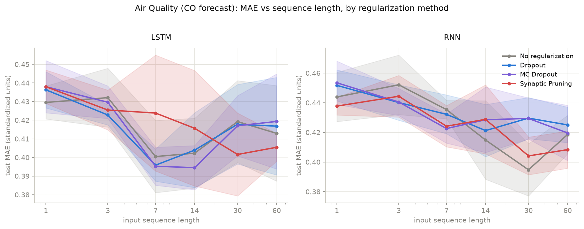
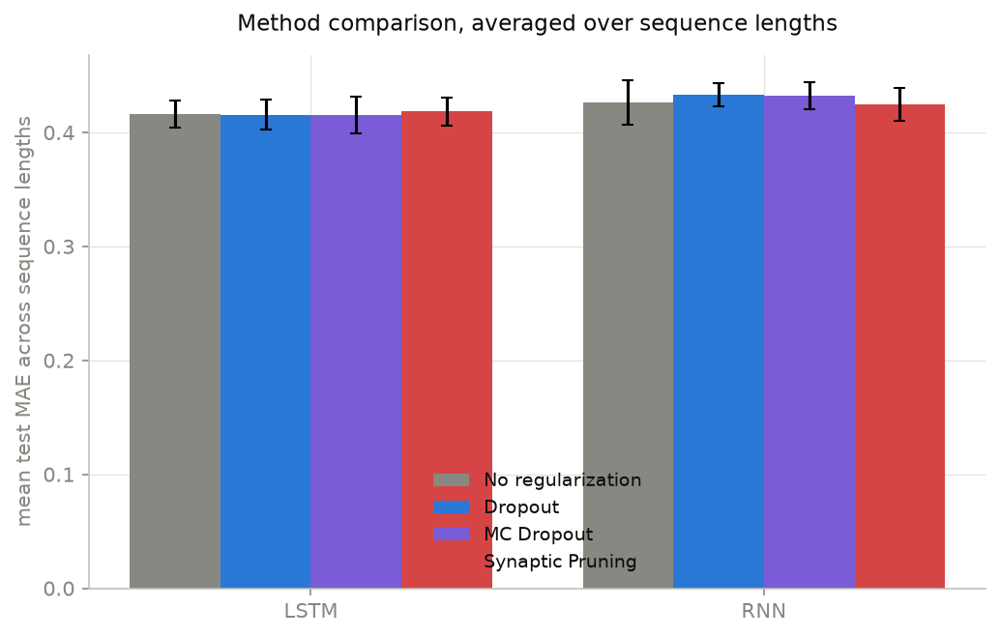

# Synaptic Pruning — results

Reproduction of Vos, van Eijk, Sarnyai & Rahimi Azghadi (2025), *"Synaptic
Pruning: A Biological Inspiration for Deep Learning Regularization"*
([arXiv:2508.09330](https://arxiv.org/abs/2508.09330),
`synaptic_pruning_review.pdf`), plus a bitter-lesson scaling test. The tables
below are generated from `results/*.json` by `python3 main.py --report` (don't
edit inside the `report:` markers). The **Reading** paragraphs are written by hand
after each full run. `synaptic_pruning.ipynb` has the full argument, with the code
that produced each number.

## Scope: where this departs from the paper

The paper reports 4 datasets × 3 architectures (RNN, LSTM, PatchTST) × 10
trials, with an undisclosed 313-feature pipeline. It claims p<0.01 and 10–52%
MAE reductions in most cells. This reproduction:

- **One dataset, not four.** UCI **Air Quality** (hourly gas-sensor series,
  downloaded fresh from `archive.ics.uci.edu`), which the paper itself calls
  "high complexity". The other three sources sit behind a Kaggle login or a JS
  proof-of-work wall and weren't reachable headlessly.
- **Two architectures, not three.** RNN and LSTM. PatchTST is skipped per the
  paper's own ablation finding of "minimal efficacy" outside recurrent
  architectures.
- **Our own features.** The 11 native sensor/weather channels plus their recent
  history (the sliding window), with no derived features. This is the largest gap
  and can't be closed, because the paper's pipeline is undisclosed.
- **Three methods, three sequence lengths.** `none`, `dropout`, `pruning` at
  `seq_len ∈ {1, 14, 60}`. MC dropout and the other three sequence lengths are
  dropped to afford **10 trials** per cell, matching the paper.
- **Dropout rate `p=0.3`** is an assumption (the paper doesn't state it),
  chosen to match the pruning schedule's `smin`.
- **MAE is in standardized units**, since the comparison is between methods.

**Changes since the first attempt.** An earlier run (5 trials, all four methods,
six sequence lengths, and a 3×3×3 bitter-lesson grid) found pruning winning 4/12
cells, with 1/12 significant, and there the baseline won. Two causes inside this
repo's control were fixed before the current run:
1. **Underpowered tests.** 5 trials left the Friedman test almost unable to
   reach significance. Now 10.
2. **A confound in the grid's compute axis.** The sparsity ramp's horizon was tied
   to each run's epoch count, so short runs hit 70% sparsity on their last epoch
   with no time to recover. `prune_schedule_epochs` now fixes the horizon
   independently. The bitter-lesson experiment also became a 6-tier ladder that
   scales model, compute and data together. See the notebook, §3.

## 1. Replication: does pruning beat dropout?

<!-- report:sp_replication_table -->
| model | seq_len | none | dropout | mc_dropout | pruning | Friedman p |
|---|---|---|---|---|---|---|
| LSTM | 1 | **0.4295** | 0.4363 | 0.4380 | 0.4380 | 0.564 |
| LSTM | 3 | 0.4321 | **0.4228** | 0.4296 | 0.4255 | 0.472 |
| LSTM | 7 | 0.4005 | 0.3958 | **0.3953** | 0.4238 | 0.178 |
| LSTM | 14 | 0.4023 | 0.4039 | **0.3945** | 0.4157 | 0.564 |
| LSTM | 30 | 0.4192 | 0.4178 | 0.4170 | **0.4016** | 0.323 |
| LSTM | 60 | 0.4129 | 0.4168 | 0.4193 | **0.4054** | 0.896 |
| RNN | 1 | 0.4439 | 0.4517 | 0.4535 | **0.4377** | 0.323 |
| RNN | 3 | 0.4521 | **0.4401** | 0.4405 | 0.4444 | 0.948 |
| RNN | 7 | 0.4354 | 0.4322 | **0.4226** | 0.4242 | 0.095 |
| RNN | 14 | **0.4149** | 0.4212 | 0.4285 | 0.4288 | 0.323 |
| RNN | 30 | **0.3947** | 0.4296 | 0.4294 | 0.4041 | **0.007** |
| RNN | 60 | 0.4185 | 0.4250 | 0.4196 | **0.4083** | 0.724 |

Mean test MAE over 5 trials (standardized units, lower is better); bold = lowest mean in the row, and p < 0.05.

_Generated from `results/replication.json` (2026-09-07, commit ?); `results/bitter_lesson.json` (2026-09-07, commit ?)._
<!-- /report -->

<!-- report:sp_replication_winrate -->
| measure | value |
|---|---|
| pruning has the lowest mean MAE | 4/12 |
| pruning beats none | 7/12 |
| pruning beats dropout | 6/12 |
| pruning beats mc_dropout | 7/12 |
| cells with Friedman p < 0.05 | 1/12 |
| — RNN seq_len=30 | p=0.007, lowest: none |
| LSTM mean MAE across seq_lens | none 0.4161, dropout 0.4156, mc_dropout 0.4156, pruning 0.4183 |
| RNN mean MAE across seq_lens | none 0.4266, dropout 0.4333, mc_dropout 0.4323, pruning 0.4246 |

_Generated from `results/replication.json` (2026-09-07, commit ?); `results/bitter_lesson.json` (2026-09-07, commit ?)._
<!-- /report -->

**Reading:**
<!-- fill: does pruning beat dropout and the baseline more often than a coin
flip? are any wins significant? how does this compare to the paper's
claimed 10-52%? -->

## 2. The bitter-lesson ladder: does the benefit survive scale?

Six tiers, each scaling LSTM width, training epochs and training rows *together*,
from `(32, 20, 4000)` to `(1024, 640, 9000)`, comparing pruning against the
unregularized baseline. If pruning's edge shrinks as the tiers grow, the method
looks like a small-scale band-aid rather than something worth scaling.

<!-- report:sp_ladder_table -->
_results/bitter_lesson.json is from the old 3×3×3 grid — rerun `python3 main.py --bitter-lesson`_

_Generated from `results/replication.json` (2026-09-07, commit ?); `results/bitter_lesson.json` (2026-09-07, commit ?)._
<!-- /report -->

<!-- report:sp_ladder_trend -->
_not yet run — `python3 main.py --bitter-lesson`_

_Generated from `results/replication.json` (2026-09-07, commit ?); `results/bitter_lesson.json` (2026-09-07, commit ?)._
<!-- /report -->

**Reading:**
<!-- fill: does the improvement grow, hold or shrink with scale? are any tiers
distinguishable from noise (CI overlap column)? -->

## Verdict

<!-- fill: is the paper's central claim confirmed on this dataset? and is the
method "bitter-lesson pilled"? three or four sentences. -->

## Caveats

<!-- fill: update after the rerun -->
- One dataset and two architectures, with our own feature pipeline (see Scope).
- Adjacent sliding windows share most of their timesteps, so a chronologically
  split test set is partly predictable by memorization at small N. This favours
  an unregularized baseline most where the data is smallest.
